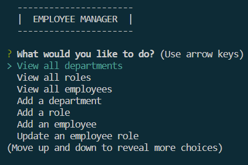
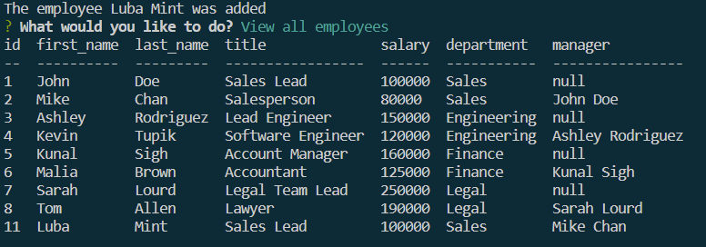
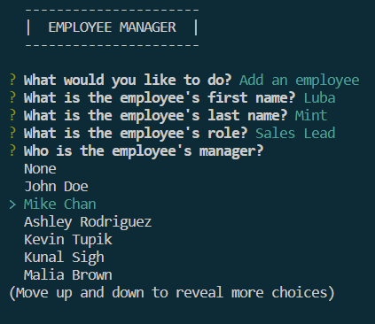

# MySQL Employee Tracker

## Description

The aim of this project was to create an employee tracker that will allow users to manage a company's employee database. Specifically, the user will be able to view the tables that contain information on company's departments, roles, and employees database, update and delete entries as needed. This application provides a user-friendly interface to interact with a database. Working on this project helped me gaininng further understanding of how to create an interactive app outside the browser that communicates with the user, and allows for a database management.

## Installation

To create this app, Inquirer, MySQL2 and console.table packages were installed.

## Usage

When the app starts, a user is prompted with a menu that provides various options for interacting with the employees database. The user can view each of the three tables: departments, roles, and employees. Additionally, they can add rows to any of the tables, update either an employee's role or manager, and delete rows from any of the tables.

## Credits

Luba Mintsys. https://github.com/lmintsys

## License

MIT License

Copyright (c) 2023 lmintsys

Permission is hereby granted, free of charge, to any person obtaining a copy
of this software and associated documentation files (the "Software"), to deal
in the Software without restriction, including without limitation the rights
to use, copy, modify, merge, publish, distribute, sublicense, and/or sell
copies of the Software, and to permit persons to whom the Software is
furnished to do so, subject to the following conditions:

The above copyright notice and this permission notice shall be included in all
copies or substantial portions of the Software.

THE SOFTWARE IS PROVIDED "AS IS", WITHOUT WARRANTY OF ANY KIND, EXPRESS OR
IMPLIED, INCLUDING BUT NOT LIMITED TO THE WARRANTIES OF MERCHANTABILITY,
FITNESS FOR A PARTICULAR PURPOSE AND NONINFRINGEMENT. IN NO EVENT SHALL THE
AUTHORS OR COPYRIGHT HOLDERS BE LIABLE FOR ANY CLAIM, DAMAGES OR OTHER
LIABILITY, WHETHER IN AN ACTION OF CONTRACT, TORT OR OTHERWISE, ARISING FROM,
OUT OF OR IN CONNECTION WITH THE SOFTWARE OR THE USE OR OTHER DEALINGS IN THE
SOFTWARE.
